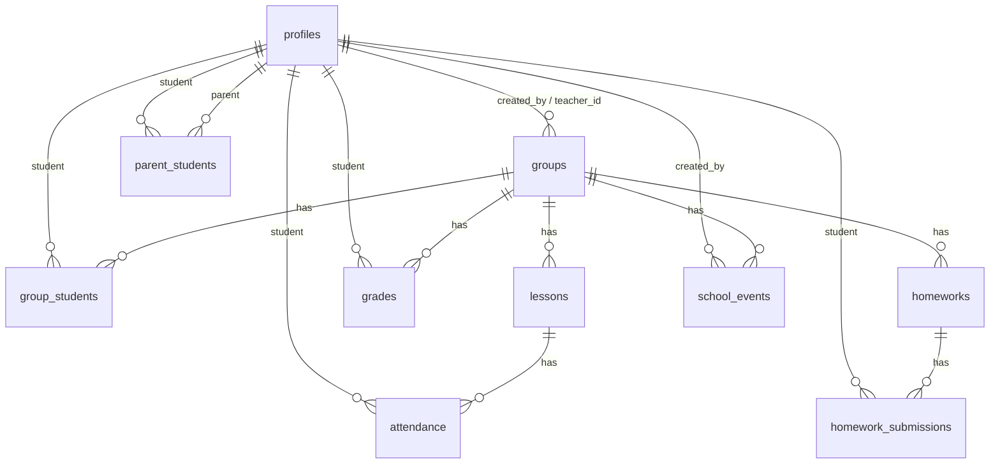

# Elite Class eDiary

Capstone project for the course **Software Technologies with AI**.  
The app is a multi-page electronic diary for a language school with role-based access for `admin`, `teacher`, `student`, and `parent`.

## Project Overview

The system supports:
- user registration, login, logout, password reset
- groups management
- students enrollment in groups
- lessons, attendance, grades, and homeworks
- school calendar events
- parent-student linking (admin only)
- homework file upload/download (Supabase Storage)

## Roles and Access

- `admin`
  - full access to all entities
  - can manage parent-student links
- `teacher`
  - manages own groups, lessons, attendance, grades, and homeworks
  - creates calendar events for own groups
- `student`
  - views own group data
  - uploads homework submission files
- `parent`
  - views data for linked children
  - views related calendar events

## Tech Stack

- Frontend: HTML, CSS, JavaScript (ES modules)
- Build tools: Node.js, npm, Vite
- Backend: Supabase
  - PostgreSQL
  - Auth
  - Storage
- Version control: Git + GitHub

## Architecture

- Multi-page app (separate HTML files):
  - `index.html`, `login.html`, `register.html`, `dashboard.html`
  - `groups.html`, `group-details.html`, `calendar.html`, `parent-links.html`
- Modular JavaScript structure:
  - `src/auth/*` for auth and dashboard
  - `src/groups/*` for groups and group details
  - `src/calendar/*` for calendar logic
  - `src/admin/*` for admin-specific modules
  - `src/lib/supabaseClient.js` for Supabase client setup
- Security model:
  - server-side RLS policies in Supabase
  - client-side guard checks for role-based UI access

## Database Schema (Main Tables)

- `profiles`
- `groups`
- `group_students`
- `parent_students`
- `lessons`
- `attendance`
- `grades`
- `homeworks`
- `homework_submissions`
- `messages`
- `school_events`

Additional:
- enums: `app_role`, `attendance_status`, `homework_status`
- storage bucket: `homework-files`

### ER Diagram (Mermaid)



## Migrations / SQL Files

Project SQL scripts are stored locally in `supabase/`:
- `supabase/access_and_calendar.sql`
- `supabase/storage_homework_files.sql`

Run these scripts in Supabase SQL Editor in order.

## Local Development Setup

1. Clone repository.
2. Install dependencies:
```bash
npm install
```
3. Create `.env`:
```env
VITE_SUPABASE_URL=your_supabase_project_url
VITE_SUPABASE_ANON_KEY=your_supabase_anon_key
```
4. Start development server:
```bash
npm run dev
```
5. Build for production:
```bash
npm run build
```

## Supabase Setup Checklist

1. Create project in Supabase.
2. Configure Auth providers (Email/Password).
3. Execute DB schema + RLS SQL.
4. Execute `supabase/access_and_calendar.sql`.
5. Execute `supabase/storage_homework_files.sql`.
6. Verify storage bucket `homework-files` exists.

## UI Screens

At least 5 screens are implemented:
- Home
- Register
- Login
- Dashboard
- Groups
- Group Details
- Calendar
- Parent-Student Links (admin)

All key pages are responsive for desktop/mobile.

## Demo Credentials

Create and provide demo users in Supabase Auth before evaluation:
- admin account
- teacher account
- student account
- parent account

## Demo Scenario (Suggested for Presentation)

1. Login as `admin` and open `Родител-ученик`.
2. Create parent-student link.
3. Open `Групи`, create a group, and assign a student.
4. Open group details and create lesson, attendance, grade, and homework.
5. Open `Календар` and create a school event for the group.
6. Login as `student` and verify:
   - group data is visible
   - homework file upload works
   - calendar event is visible
7. Login as `parent` and verify child-related visibility:
   - group and calendar data for linked child
   - no access to unrelated groups

## Deployment

Deploy to a static hosting service (Vercel/Netlify).  
Set environment variables:
- `VITE_SUPABASE_URL`
- `VITE_SUPABASE_ANON_KEY`

## Repository Notes

- Keep regular commit history (15+ commits on 3+ days).
- Use small commits per completed feature/fix.
- Include this README and SQL scripts for transparent project review.


