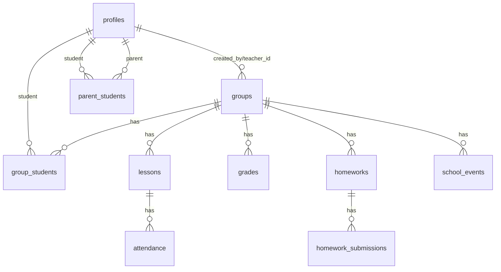

# Elite Class eDiary

Electronic diary platform for **Elite Lingua Language School**.  
Capstone project for **Software Technologies with AI**.

## 1) Project Description

The app supports school operations for four roles:
- `admin`: manages users/roles, parent-student links, full platform visibility
- `teacher`: manages own groups, lessons, attendance, grades, homeworks, calendar events
- `student`: sees own groups/schedule/grades/homeworks, uploads homework files
- `parent`: sees linked student data and related events

## 2) Architecture

- Frontend: multi-page HTML + Bootstrap UI + modular JavaScript
- Backend: Supabase (PostgreSQL, Auth, Storage, RLS)
- Build tools: Node.js, npm, Vite
- Communication: Supabase REST/Auth/Storage APIs from browser client

### Main folders
- `src/auth/` auth flows and dashboard logic
- `src/groups/` groups and group-details logic
- `src/calendar/` school events calendar
- `src/admin/` admin panel logic
- `src/teacher/` teacher-specific hours page
- `src/lib/` shared Supabase client
- `supabase/` SQL schema/migration scripts
- `.github/copilot-instructions.md` AI agent instructions and project context

## 3) App Screens (separate files)

- `index.html` (landing page)
- `login.html`
- `register.html`
- `forgot-password.html`
- `reset-password.html`
- `dashboard.html`
- `my-hours.html`
- `groups.html`
- `group-details.html`
- `calendar.html`
- `parent-links.html` (admin panel)

Responsive behavior is implemented for desktop and mobile.

## 4) Database Design

Main tables include:
- `profiles`
- `groups`
- `group_students`
- `parent_students`
- `lessons`
- `attendance`
- `grades`
- `homeworks`
- `homework_submissions`
- `school_events`
- `messages`

Enums:
- `app_role`
- `attendance_status`
- `homework_status`

Indexes and FK relations are used across core entities.

### ER Diagram (high-level)



## 5) Auth, Roles, Security

- Supabase Auth: register/login/logout/password reset
- JWT sessions handled by Supabase client
- Server-side access control via RLS policies
- Role-based visibility and actions in UI
- Admin-only actions exposed in `parent-links.html`

## 6) Storage

Supabase Storage buckets:
- `homework-files` for student homework upload/download
- `profile-avatars` for profile image upload

## 7) SQL Migration Scripts (committed in repo)

Run in Supabase SQL Editor:
1. `supabase/access_and_calendar.sql`
2. `supabase/storage_homework_files.sql`
3. `supabase/parent_invites.sql`
4. `supabase/profile_fields.sql`
5. `supabase/storage_profile_avatars.sql`
6. `supabase/admin_user_tools.sql`
7. `supabase/demo_seed_role_data.sql` (optional demo data)

## 8) Local Development Setup

1. Install dependencies:
```bash
npm install
```
2. Create `.env`:
```env
VITE_SUPABASE_URL=your_project_url
VITE_SUPABASE_ANON_KEY=your_anon_key
```
3. Run dev server:
```bash
npm run dev
```
4. Build:
```bash
npm run build
```

## 9) Demo Credentials

Use the prepared credentials shared with exam reviewers:
- Admin account: provided separately
- Teacher account: provided separately
- Student account: provided separately
- Parent account: provided separately

## 10) Deployment

Live URL: `https://eliteclassediary.netlify.app`

Recommended platforms:
- Vercel
- Netlify

Remember to set env vars in hosting platform:
- `VITE_SUPABASE_URL`
- `VITE_SUPABASE_ANON_KEY`
